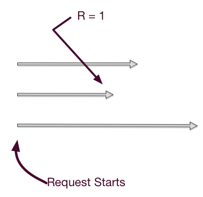

!SLIDE smbullets

# Knobs #

* `N`
* `R/W/DW`
* `PR/PW`
* `allow_mult`
* `last_write_wins`
* `delete_mode`

!SLIDE bullets

* some per request
* all per bucket

!SLIDE bullets

# N #

* the number of replicas

!SLIDE bullets

# R/W #

* vnodes to respond before successful
* tunes latency and consistency profile

!SLIDE center

!SLIDE bullets

# DW #

* vnodes to respond synced to disk

!SLIDE bullets

# PR/PW #

* same as P/W but _must_ be primary vnodes

!SLIDE bullets

# read-your-writes #

* `PR + PW > N`
* `R + W > N` is close

!SLIDE bullets

# allow_mult false #

* per bucket
* the default
* one value returned to you
* writes can be lost with frequent/slow multi-writer
* does use siblings under the hood

!SLIDE bullets

# allow_mult true #

* this is where the fun happens
* siblings!
* conflict resolution

!SLIDE bullets

# last_write_wins true #

* no vector clocks
* useful for insert-only (no updates)
* useful for caching
* uses wallclock

!SLIDE bullets

# undefined #

* allow_mult=true
* last_write_wins=true

!SLIDE bullets

# delete_mode #

* `immediate`
* `3s` (default)
* `10s`
* `keep`
