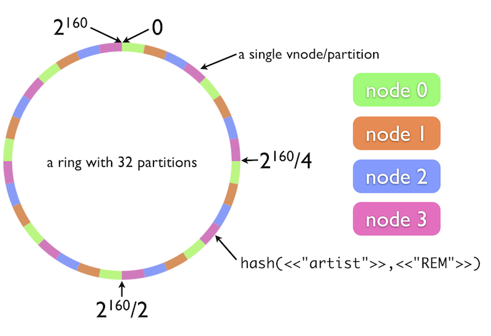

!SLIDE bullets

# Riak #

* Basho
* open source
* highly available
* distributed database

!SLIDE bullets

.notes put comic here

* erlang
* dynamo implementation
* HTTP REST / PB API

!SLIDE bullets

# distributed for #

* availability
* durability
* throughput
* capacity

!SLIDE bullets

# Data Model #

* key/value
* secondary indexes
* full-text search
* mapreduce
* large files
* links

!SLIDE bullets

* consistent hashing
* N replicas
* buckets (mostly a namespace/defaults)

!SLIDE center

!SLIDE bullets

* no master
* any node serves any request

!SLIDE commandline

# trivial clustering #

    $bin/riak-admin join dev1@127.0.0.1
    Sent join request to dev1@127.0.0.1

!SLIDE commandline
    $bin/riak-admin member_status
    ================================= Membership ==================================
    Status     Ring    Pending    Node
    -------------------------------------------------------------------------------
    valid      50.0%      --      'dev1@127.0.0.1'
    valid      50.0%      --      'dev2@127.0.0.1'
    -------------------------------------------------------------------------------
    Valid:2 / Leaving:0 / Exiting:0 / Joining:0 / Down:0

!SLIDE bullets

# Riak Interprise

* Multi-DC Replication
* Monitoring
* Support (our support team is amazing!)
